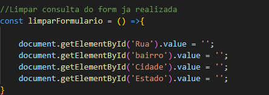
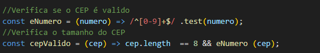
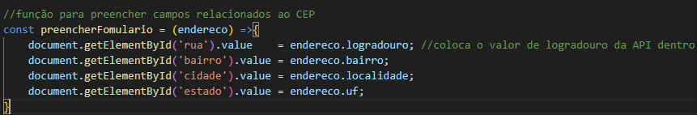
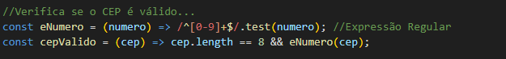
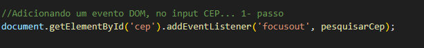
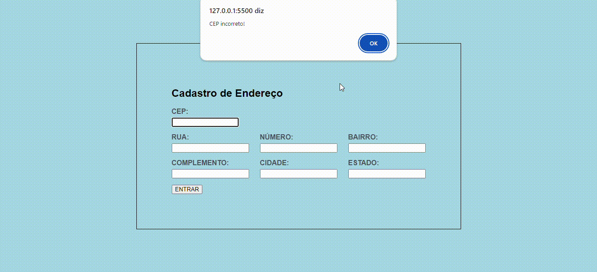

# form-CadEndereco
O projeto a seguir tem como objetivo coletar, armazenar e manipular informações de endereço de usuários ou clientes. Para fazer esse projeto estamos usando de base o site https://viacep.com.br/. Nele encontramos informações e codigos para ser reutilizados.

## função de limpar consulta do form já realizada 
    
Esse código define uma função em JavaScript chamada `limparFormulario`, que limpa (ou seja, apaga) os valores de determinados campos de um formulário HTML.
Aqui está uma explicação detalhada:
## 1. **Função `limparFormulario`**:  
  - É uma função de seta (arrow function) em JavaScript. Esse formato de função é uma sintaxe mais curta e moderna para definir funções.  
  - Não recebe parâmetros.
2. **Objetivo da Função**:  
  - A função limpa o conteúdo dos campos de um formulário HTML, definindo os valores (`value`) de determinados campos como vazios.  
3. **Acessando os Elementos do Formulário**:  
  - A função utiliza `document.getElementById()` para obter elementos do formulário pelo seu `id`. O `id` é um identificador único de um elemento HTML.  
  Exemplo: `document.getElementById('Rua')` seleciona o campo de input cujo `id` é "Rua". 
4. **Limpando os Valores**:  
  - Para cada campo selecionado, o código define o valor (`value`) como uma string vazia (`''`), o que efetivamente apaga qualquer dado inserido no campo.  
5. **Campos Alvo**:  
  - A função está configurada para limpar os campos de:  
    - **Rua** (`id='Rua'`)
    - **Bairro** (`id='bairro'`)  
    - **Cidade** (`id='Cidade'`)  
    - **Estado** (`id='Estado'`)  

   ## Este código define duas funções em JavaScript para verificar se um CEP (Código de Endereçamento Postal) é válido.  
  

 Explicação do código:  
1 Função eNumero:  
◦ Esta função verifica se a string numero passada como argumento contém apenas números.  
◦ Utiliza uma expressão regular /^[0-9]+$/ que verifica se a string é composta apenas de dígitos de 0 a 9:  
▪ ^ indica o início da string.  
▪ [0-9]+ indica que deve haver um ou mais dígitos.  
▪ $ indica o final da string.  
◦ O método .test(numero) verifica se a string numero corresponde à expressão regular.   
2 Resumo: A função retorna true se a string contiver apenas números, ou false caso contrário.    

 O código define a função `preencherFomulario`, que tem o propósito de preencher automaticamente os campos de um formulário HTML com os dados de um endereço fornecido (provavelmente obtido por meio de uma API de CEP).  

### Explicação:  
1. **Função `preencherFomulario`**:  
  - A função recebe um parâmetro chamado `endereco`, que é um objeto contendo informações de um endereço (como `logradouro`, `bairro`, `localidade`, e `uf`).  
  - Usando `document.getElementById()`, ela acessa os campos de input do formulário HTML pelo `id`, e então define o valor desses campos com as respectivas informações do objeto `endereco`.  
2. **Preenchimento dos Campos**:  
  - Cada linha da função acessa um campo específico do formulário e insere o valor correspondente do objeto `endereco`:  
    - `document.getElementById('rua').value = endereco.logradouro;`    
      - Define o valor do campo de **rua** com o dado `logradouro` do objeto `endereco`.  
    - `document.getElementById('bairro').value = endereco.bairro;`    
      - Define o valor do campo de **bairro** com o dado `bairro`.  
    - `document.getElementById('cidade').value = endereco.localidade;`    
      - Define o valor do campo de **cidade** com o dado `localidade`.
    - `document.getElementById('estado').value = endereco.uf;`    
      - Define o valor do campo de **estado** com o dado `uf`, que representa a unidade federativa (estado).  
3. **Origem do Objeto `endereco`**:  
  - Embora não esteja explícito no código, geralmente o objeto `endereco` é obtido a partir de uma chamada a uma API de CEP, como a API dos Correios ou uma outra base de dados que retorna informações do endereço a partir de um CEP informado pelo usuário.  

### Resumo:  
A função `preencherFomulario` pega os dados de um endereço (contidos no objeto `endereco`) e automaticamente insere esses dados nos respectivos campos de um formulário, como rua, bairro, cidade e estado. Isso torna a interação do usuário com o formulário mais ágil, evitando que ele precise digitar manualmente as informações.
tem menu de contexto

## Análise do CEP
  
Explicação das Funções  
Função eNumero:  

Definição: Essa função recebe um argumento chamado numero.  
Expressão Regular: A expressão regular /^[0-9]+$/ é utilizada para verificar se a string numero contém apenas dígitos de 0 a 9.  
^ indica o início da string.  
[0-9]+ verifica se há um ou mais dígitos.  
$ indica o final da string.  
Método test: A função retorna true se a string corresponder à expressão regular (ou seja, se for composta apenas por números) e false caso contrário.  

## Função cepValido:  

Definição: Essa função recebe um argumento chamado cep.  
Condições de Validade:  
cep.length == 8: Verifica se o comprimento do CEP é igual a 8 caracteres. Isso é um requisito típico para CEPs no Brasil.  
eNumero(cep): Chama a função eNumero para verificar se o CEP contém apenas dígitos.  
Resultado: A função retorna true se ambas as condições forem satisfeitas (comprimento igual a 8 e composto apenas por números), e false caso contrário.  
Exemplos de Uso:  
cepValido("12345678") retornaria true (é um CEP válido).  
cepValido("1234a678") retornaria false (contém uma letra).  
cepValido("12345") retornaria false (comprimento inválido).    

## Análise do código PESQUISAR CEP 

## Explicação dos Componentes  

## Função Assíncrona (async):

A palavra-chave async permite que você use await dentro da função, que é usada para esperar a resolução de promessas.  

limparFormulario():

Essa função é chamada para limpar quaisquer dados previamente preenchidos no formulário antes de fazer uma nova busca.  

## Construção da URL:

A URL para a API do ViaCEP é criada usando o valor do CEP inserido (cep.value).    

Verificação de Validade do CEP:

A função cepValido(cep.value) verifica se o CEP inserido é válido. Se for, o código prossegue com a busca.  

## Busca de Dados (fetch):  

const dados = await fetch(url); faz uma requisição à API do ViaCEP.
fetch retorna uma promessa que resolve para a resposta da requisição.
const addres = await dados.json(); converte a resposta em formato JSON, permitindo que você trabalhe com os dados.

## Verificação de Erro:  

addres.hasOwnProperty('erro'): verifica se a resposta contém a propriedade erro, indicando que o CEP não foi encontrado.  
Se erro estiver presente, um alerta é mostrado informando que o CEP não foi encontrado.
Caso contrário, a função preencherFormulario(addres) é chamada para preencher o formulário com os dados retornados da API.   
 
## Tratamento de CEP Incorreto:

Se o CEP não for válido, um alerta é mostrado informando que o CEP está incorreto.    

## Código de preenchimento 

  

## Explicação do Código 

document.getElementById('cep'):

Esta parte do código seleciona um elemento do DOM (Document Object Model) com o ID cep. Esse elemento é geralmente um campo de entrada onde o usuário insere o CEP.  

addEventListener:  

O método addEventListener é usado para registrar um evento no elemento selecionado. Ele escuta por um evento específico e, quando esse evento ocorre, executa uma função.  

Evento focusout:  
  
O evento focusout é acionado quando o elemento perde o foco. Isso significa que, quando o usuário clica fora do campo de entrada ou navega para outro campo, esse evento é disparado.  

pesquisarCep:

Esta é a função que será chamada quando o evento focusout ocorrer. Nesse caso, a função pesquisarCep será executada para buscar as informações do CEP que o usuário digitou.
Comportamento
Quando o usuário termina de digitar o CEP e clica fora do campo (ou navega para outro campo), a função pesquisarCep será chamada automaticamente. Isso inicia o processo de validação e, se o CEP for válido, a busca das informações correspondentes na API do ViaCEP.

## Resumo:
Esse código cria uma interação no formulário, permitindo que as informações do CEP sejam processadas assim que o usuário terminar de inserir os dados. Essa abordagem melhora a experiência do usuário, evitando a necessidade de um botão separado para realizar a pesquisa.
  
  ##  as seguintes fontes:
## JavaScript e Funções:  

MDN Web Docs - JavaScript: MDN JavaScript      
MDN Web Docs - Funções: Funções em JavaScript  

## Expressões Regulares    
MDN Web Docs - Expressões Regulares  
Validação de Dados em Formulários:     
MDN Web Docs - Validação de Formulários:     
 Validação de Formulários em HTML e JavaScript    
API ViaCEP    
ViaCEP: API ViaCEP (documentação sobre como usar a API de busca de CEPs)    

## A seguir, o resultado:
